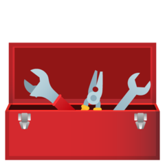

  
  <h3 align="center">Toolbox</h3>
  
A collection of simple, optimized utility functions that help you spend more time implementing real features instead of writing the same snippets over and over.

# Contributors ✨

Thanks goes to these wonderful people ([emoji key](https://allcontributors.org/docs/en/emoji-key)):

<!-- ALL-CONTRIBUTORS-LIST:START - Do not remove or modify this section -->
<!-- prettier-ignore-start -->
<!-- markdownlint-disable -->
<table>
  <tbody>
    <tr>
      <td align="center"><a href="https://github.com/MichalTarasiuk"> <b>Michał Tarasiuk</b></a> <a href="#ideas-MichalTarasiuk" title="Ideas, Planning, & Feedback">🤔</a> <a href="https://github.com/MichalTarasiuk/toolbox/commits?author=MichalTarasiuk" title="Code">💻</a> <a href="#maintenance-MichalTarasiuk" title="Maintenance">🚧</a></td>
      <td align="center"><a href="https://github.com/lukk12"> <b>lukk12</b></a> <a href="#ideas-lukk12" title="Ideas, Planning, & Feedback">🤔</a> <a href="https://github.com/MichalTarasiuk/toolbox/commits?author=lukk12" title="Code">💻</a></td>
    </tr>
  </tbody>
</table>

<!-- markdownlint-restore -->
<!-- prettier-ignore-end -->

<!-- ALL-CONTRIBUTORS-LIST:END -->
